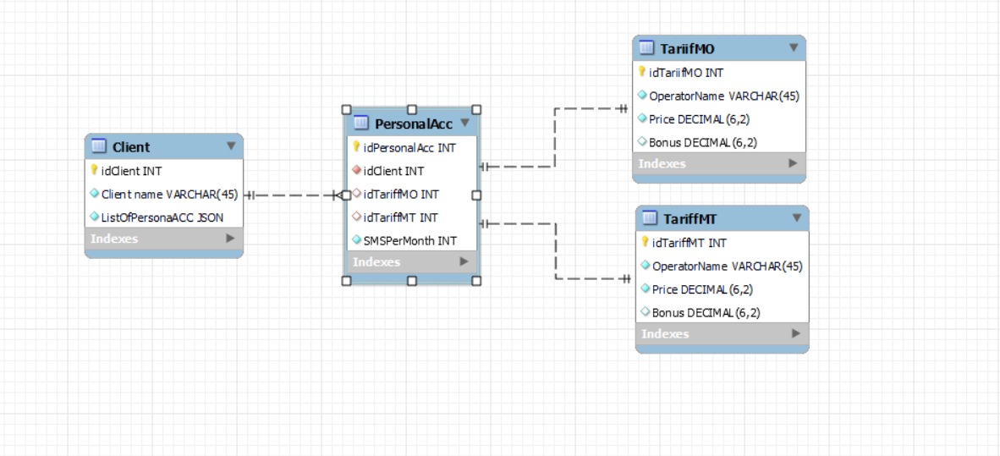

# SQL_Test_Task
Выполнение тестового задания по построению модели тариф/клиент.

## Задание:
### Требование к процедуре выполнения задания:

    1. Предложить на уровне объектной модели\ER диаграммы оптимальную модель сущности «Тариф» по требованиям пункта 2.
    
    2. Для обеспечения целостности и наглядности модели можно использовать сущности, не заявленные в требованиях.
    
    3. Моделирование может быть выполнено в любом редакторе. 
    
### Описание требований:

Система обеспечивает передачу SMS трафика от Клиентов к SMSC (цент обработки коротких сообщений) операторов. Для каждого клиента на уровне Тарифа устанавливается плата за услугу доставки SMS. Цена сообщения определяется на основании хранимого тарифа. Тарифный план — это набор правил тарификации трафика клиентов в системе. Параметры тарифа:

    1. Тариф может быть применен глобально, к клиенту или к лицевому счёту клиента. Параметры глобального тарифа могут быть переопределены тарифом на клиенте или лицевом счёте (лицевых счетов может быть более одного).   
    
    2. Тариф применяется к конкретному направлению МТ-трафика или к МО-трафику;
    
    3. Тариф может содержать правила для случаев отнесения получателя к тому или иному оператору моб. связи;
    
    4. Тариф может содержать правила формирования цены для диапазона количества сообщений в месяц на уровне лицевого счёта;
    
    5. На уровне тарифа может применяться скидка в % по трафику в зависимости от достижения клиентом минимального количества сообщений. Из подсчёта количества могут быть исключены сообщения на определённого оператора;
    
    6. На уровне тарифа устанавливается фиксированное периодическое начисление;
    
    7. В системе должна быть предусмотрена возможность расширения правил задания цены для тарифа без необходимости изменения модели данных. 

## Выполнение
### Скриншот ER-диаграммы:

### Описание выполнения:
В данной ER-диаграмме имеем 4 сущности:

    1. Клиент(Client)
    
    2. Лицевой счет(PersonalAcc)
    
    3. МО тариф(TariffMO)
    
    4. МТ тариф(TariffMT)
  
Клиент имеет следующий атрибуты: уникальный идентификатор (idClient) типа INT, имя клиента (ClientName) типа VARCHAR длины 45 и список идентификаторов лицевых счетов (ListOfPersonalAcc) типа JSON, так как у каждого клиента может быть несколько лицевых счетов.

Лицевой счет имеет следующие атрибуты: уникальный идентификатор (idPersonalAcc) типа INT, уникальный идентификатор клиента (idClient) типа INT, с помощью которого устанавливается связь one-to-many c сущностью Клиент, уникальный идентификатор МО и МТ тарифов (idTariffMO и idTariffMO соответственно) типа INT, с их помощью устанавливается связь типа one-to-one с сущностями МО тариф и МТ тариф, количество СМС в месяц (SMSperMonth) типа INT.

МО и МТ тарифы были вынесены в разные сущности, так как в задании требовалось, чтобы тариф действовал на МО траффик или на МТ траффик раздельно. МО и МТ тарифы имеют следубщие атрибуты: уникальный идентификатор (idTariffMO и idTariffMT) типов INT, имя мобильного оператора (OperatorName) типа VARCHAR длины 45, цена тарифа (PRICE) типа DECIMALБ а также бонус за количество СМС в месяц (bonus) типа DECIMAL.
